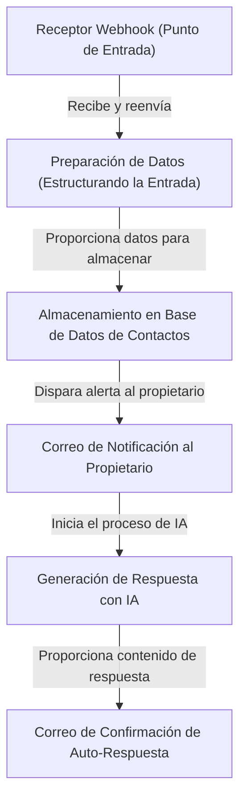
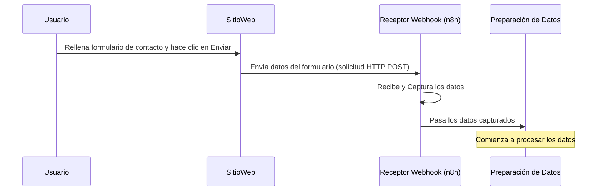
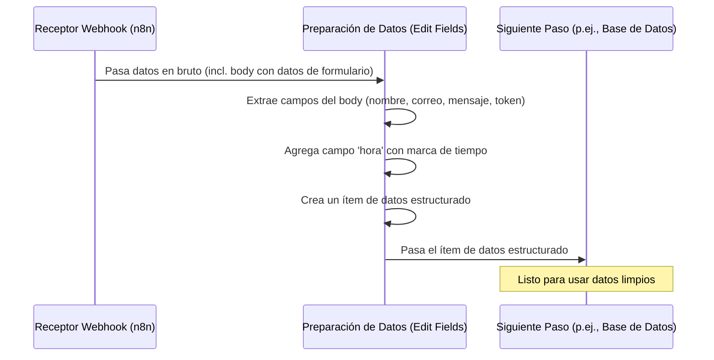
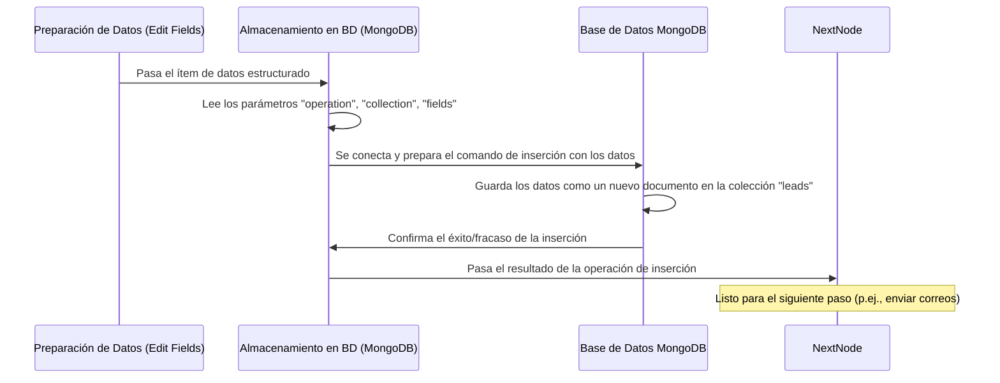
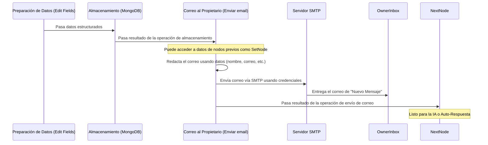
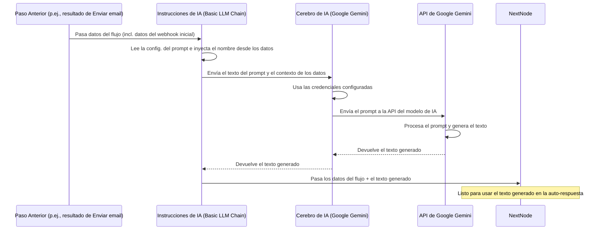

# Tutorial: n8n-formulario-de-contacto

Este proyecto actúa como un sistema automatizado para gestionar los envíos de formularios de contacto de un sitio web.
**Escucha** por nuevos mensajes, **organiza** la información entrante, **guarda** una copia en una base de datos, **alerta** al propietario del sitio web por correo electrónico, **usa IA** para redactar una respuesta amigable y **envía** un correo electrónico de confirmación automático a la persona que envió el formulario.

## Vista General Visual



## Capítulos

1.  [Receptor Webhook (Punto de Entrada)](01_receptor_webhook__punto_de_entrada__.md)
2.  [Preparación de Datos (Estructurando la Entrada)](02_preparacion_de_datos__estructurando_la_entrada__.md)
3.  [Almacenamiento en Base de Datos de Contactos](03_almacenamiento_en_base_de_datos_de_contactos.md)
4.  [Correo de Notificación al Propietario](04_correo_de_notificacion_al_propietario_.md)
5.  [Generación de Respuesta con IA](05_generacion_de_respuesta_con_ia_.md)
6.  [Correo de Confirmación de Auto-Respuesta](06_correo_de_confirmacion_de_auto_respuesta_.md)

---

# Capítulo 1: Receptor Webhook (Punto de Entrada)

¡Bienvenido al primer capítulo de nuestro tutorial sobre cómo construir un flujo de trabajo de automatización de formularios de contacto usando n8n!

Imagina que tienes un sitio web con un formulario de contacto. Cuando alguien lo completa y hace clic en "Enviar", quieres que ocurra toda una serie de cosas automáticamente: quizás guardar su mensaje, enviarte una notificación por correo electrónico, tal vez enviarle un mensaje de agradecimiento automático e incluso usar IA para entender mejor su consulta.

¿Cómo haces que todos estos pasos automatizados *comiencen* en el momento en que alguien envía el formulario? Necesitas una forma para que tu sitio web "hable" con tu sistema de automatización (n8n) y le diga: "¡Oye, alguien acaba de enviar un mensaje! Aquí está su información".

Aquí es donde entra en juego el **Receptor Webhook (Punto de Entrada)**.

## El Timbre Digital

Piensa en tu flujo de trabajo de n8n como una casa, y el Receptor Webhook es el **timbre**. Configuras este timbre (el webhook) en una dirección específica (una URL única). Cuando alguien visita tu sitio web y envía el formulario de contacto, tu sitio web envía una señal a esa dirección específica, ¡como si estuviera tocando el timbre!

El Receptor Webhook está constantemente esperando, o **escuchando**, en esa dirección. En el momento en que escucha el "ding" (recibe la señal), sabe que hay alguien en la puerta listo para entregar un mensaje.

Su trabajo principal es:

1.  **Escuchar:** Mantenerse activo y listo para recibir mensajes entrantes en su dirección única.
2.  **Recibir:** Aceptar los datos (como el nombre, correo electrónico y mensaje) enviados por el formulario del sitio web.
3.  **Capturar:** Retener estos datos para que los siguientes pasos en tu flujo de trabajo puedan usarlos.
4.  **Iniciar el Flujo:** Una vez que los datos son capturados, da inicio al resto del proceso de automatización que has diseñado en n8n.

Es, literalmente, el **punto de entrada** para tu flujo de trabajo. Sin él, tu automatización de n8n no sabría *cuándo* ejecutarse ni *qué* datos procesar.

## Cómo Funciona en la Práctica

En n8n, el "timbre" está representado por un nodo especial llamado el **nodo Webhook**.

Configuras este nodo con una **ruta de URL** específica. Cuando activas tu flujo de trabajo, n8n le da a este nodo Webhook una dirección web única (una URL) donde escuchará.

El formulario de contacto de tu sitio web se configura para enviar sus datos (el envío del formulario) como una solicitud HTTP (generalmente una solicitud POST) a esa URL específica proporcionada por n8n.

Aquí tienes un vistazo simplificado a la configuración del nodo "Webhook" de nuestro archivo de flujo de trabajo `Formulario-N8N.json`:

```json
{
  "parameters": {
    "httpMethod": "POST",
    "path": "e50837e7-7363-432b-b765-9f946f66e710",
    "options": {}
  },
  "type": "n8n-nodes-base.webhook",
  "typeVersion": 2,
  "position": [
    -120,
    0
  ],
  "id": "4a0e66f7-bb3c-413e-847b-fb2903f5543f",
  "name": "Webhook",
  "webhookId": "e50837e7-7363-432b-b765-9f946f66e710"
}
```

* `"type": "n8n-nodes-base.webhook"`: Esto le dice a n8n que este nodo es el receptor Webhook estándar.
* `"name": "Webhook"`: Este es el nombre del nodo tal como aparece en el editor de n8n. ¡Nos referiremos a este nodo por este nombre más adelante!
* `"httpMethod": "POST"`: Esto especifica que el nodo está escuchando una solicitud `POST`, que es la forma estándar en que los formularios web envían datos.
* `"path": "e50837e7-7363-432b-b765-9f946f66e710"`: Esta es la parte única de la URL que n8n genera. Solo las solicitudes enviadas a esta ruta específica activarán *este* nodo webhook.

Cuando este nodo recibe una solicitud, captura toda la información que vino con ella. Esta información se pone a disposición como **datos JSON** que los siguientes nodos en el flujo de trabajo pueden usar.

Para nuestro formulario de contacto, la parte importante de los datos recibidos es el `body` (cuerpo) de la solicitud, que contiene la información enviada a través de los campos del formulario como `nombre`, `correo` y `mensaje`.

Aquí hay un ejemplo de lo que el nodo Webhook podría capturar (basado en los datos de muestra en el flujo de trabajo):

```json
{
  "headers": {
    // ... (mucha información técnica de cabeceras)
  },
  "params": {},
  "query": {},
  "body": {
    "nombre": "toto",
    "correo": "ren32corp@gmail.com",
    "mensaje": "pruebaa veinteee",
    "token": "HFcDFwY0hWL0A..." // (otros datos del formulario)
  },
  "webhookUrl": "https://tu-url-de-n8n/webhook/e50837e7-7363-432b-b765-9f946f66e710",
  "executionMode": "production"
}
```

¿Ves la parte `"body"`? ¡Esos son los datos reales del envío del formulario de contacto! El nodo Webhook recibe esto y lo proporciona al siguiente paso en el flujo de trabajo.

## Flujo Paso a Paso (Simplificado)

Visualicemos cómo el receptor webhook actúa como punto de partida:



1.  **Acción del Usuario:** una persona interactúa con el formulario de contacto en tu sitio web.
2.  **El Sitio Web Envía Datos:** el sitio web está configurado para tomar la información que el usuario ingresó y enviarla a la URL única de tu webhook de n8n.
3.  **Webhook Escucha y Captura:** el nodo Webhook de n8n, escuchando constantemente en su URL, recibe estos datos. Captura todos los detalles de la solicitud, especialmente los datos del formulario en el cuerpo.
4.  **El Flujo de Trabajo Comienza:** los datos capturados se envían como un "ítem" o "entrada" al siguiente nodo en el flujo de trabajo de n8n, activando la secuencia de automatización.

## Conclusión

El Receptor Webhook es el primer paso esencial en nuestra automatización de formularios de contacto. Es el mecanismo que permite que eventos externos, como el envío de un formulario en un sitio web, activen nuestro flujo de trabajo de n8n. Espera pacientemente los mensajes entrantes y, cuando llega uno, captura los datos e inicia los pasos posteriores.

Ahora que sabemos cómo los datos *entran* en nuestro flujo de trabajo, el siguiente paso es asegurarnos de que esos datos estén en un formato que sea fácil de usar para el resto de nuestra automatización.

Pasemos a **[Preparación de Datos (Estructurando la Entrada)](02_preparacion_de_datos__estructurando_la_entrada__.md)** para ver cómo limpiamos y organizamos la información capturada.

---

# Capítulo 2: Preparación de Datos (Estructurando la Entrada)

¡Bienvenido de nuevo! En el capítulo anterior, [Receptor Webhook (Punto de Entrada)](01_receptor_webhook__punto_de_entrada__.md), aprendimos cómo el nodo Webhook actúa como el "timbre digital", capturando la información en bruto enviada por el formulario de contacto de tu sitio web en el momento en que alguien lo envía.

Ahora que tenemos los datos dentro de nuestro flujo de trabajo de n8n, debemos asegurarnos de que estén organizados y listos para los siguientes pasos. Piensa en los datos recibidos por el webhook como el correo entregado en tu puerta: está todo allí (cartas, paquetes, correo no deseado), pero necesita ser clasificado antes de que puedas hacer algo útil con él.

## La Máquina de Clasificación de Datos

Los datos en bruto de un webhook a veces pueden contener muchos detalles técnicos (como cabeceras, parámetros de consulta, etc.) junto con los datos reales del envío del formulario. Para nuestro flujo de trabajo, solo nos importan piezas específicas de información del formulario, como el nombre, el correo electrónico y el mensaje de la persona. Además, podríamos querer agregar algo de contexto extra, como *exactamente cuándo* se recibió el mensaje.

Aquí es donde entra el paso de **Preparación de Datos (Estructurando la Entrada)**. Es como una máquina de clasificación o un asistente personal que toma la entrada en bruto, identifica las partes importantes, las etiqueta claramente y, a veces, agrega información nueva y útil.

El problema que resolvemos aquí es transformar los datos de entrada "desordenados" o exhaustivos del webhook en un formato limpio y estandarizado que sea fácil de entender y usar para los nodos posteriores (como guardar en una base de datos o enviar correos electrónicos).

## Cómo Estructurar Datos en n8n

En n8n, un nodo común y potente para transformar y estructurar datos es el **nodo Set**.

El nodo Set te permite:

1.  **Mantener o Eliminar Datos:** decidir qué piezas de información quieres llevar adelante en tu flujo de trabajo.
2.  **Renombrar Datos:** dar nombres claros y consistentes a los campos de datos.
3.  **Agregar Nuevos Datos:** crear piezas de información completamente nuevas, como una marca de tiempo.
4.  **Cambiar el Tipo de Dato:** (Más avanzado, pero posible) convertir datos entre texto, números, etc.

En nuestro flujo de trabajo `Formulario-N8N.json`, el nodo que sigue inmediatamente al nodo "Webhook" es un nodo Set llamado **"Edit Fields"** (Editar Campos). Su trabajo es precisamente esta preparación de datos.

Veamos cómo el nodo "Edit Fields" toma los datos del nodo "Webhook" y los organiza.

### Datos de Entrada (del Webhook)

Basado en nuestro ejemplo del Capítulo 1, el ítem de datos que *entra* en el nodo "Edit Fields" se ve algo así (nos centramos en la parte `body` donde están los datos del formulario):

```json
{
  "headers": { /* ... información técnica ... */ },
  "params": {},
  "query": {},
  "body": {
    "nombre": "toto",
    "correo": "ren32corp@gmail.com",
    "mensaje": "pruebaa veinteee",
    "token": "HFcDFwY0hWL0A..."
  },
  "webhookUrl": "https://...",
  "executionMode": "production"
}
```
La información clave que necesitamos está anidada dentro de `"body"`.

### Datos de Salida (del nodo Set "Edit Fields")

El nodo "Edit Fields" está configurado para extraer `nombre`, `correo`, `mensaje` y `token` del `body` y también agregar un nuevo campo llamado `hora` con la hora actual. El ítem de datos que *sale* del nodo "Edit Fields" se verá más simple y enfocado:

```json
{
  "nombre": "toto",
  "correo": "ren32corp@gmail.com",
  "mensaje": "pruebaa veinteee",
  "token": "HFcDFwY0hWL0A...",
  "hora": "20/6/2024, 15:30:00" // Ejemplo de marca de tiempo
}
```
Observa cómo los campos ahora están directamente en el nivel superior, y se ha agregado el campo `hora`. Esta estructura es mucho más fácil de trabajar para los siguientes nodos.

## Configurando el Nodo Set ("Edit Fields")

Examinemos la parte relevante del archivo `Formulario-N8N.json` que configura el nodo Set "Edit Fields":

```json
{
  "parameters": {
    "assignments": {
      "assignments": [
        {
          "id": "...",
          "name": "nombre",
          "value": "={{$json.body.nombre}}",
          "type": "string"
        },
        {
          "id": "...",
          "name": "correo",
          "value": "={{$json.body.correo}}",
          "type": "string"
        },
        {
          "id": "...",
          "name": "mensaje",
          "value": "={{$json.body.mensaje}}",
          "type": "string"
        },
        {
          "id": "...",
          "name": "hora",
          "value": "={{ new Date().toLocaleString(\"es-VE\", { timeZone: \"America/Caracas\" }) }}",
          "type": "string"
        },
        {
          "id": "...",
          "name": "token",
          "value": "={{ $json.body.token }}",
          "type": "string"
        }
      ]
    },
    "options": {}
  },
  "type": "n8n-nodes-base.set",
  "typeVersion": 3.4,
  "position": [ 100, 0 ],
  "id": "9fd05138-19c4-4eae-a45b-1e7eaa7cc7fb",
  "name": "Edit Fields" // Este es nuestro nodo Set
}
```
Desglosemos la parte clave, la sección `"assignments"`:

* `"name": "nombre"`, `"value": "={{$json.body.nombre}}"`: Esto crea un nuevo campo llamado `nombre`. El `={{...}}` es una **expresión** de n8n. Significa "obtén el valor del ítem de datos de *entrada* (`$json`), específicamente del objeto `body`, y dentro de `body`, obtén el valor del campo `nombre`". Así, toma el `nombre` del cuerpo del webhook y lo coloca en un nuevo campo llamado `nombre` en el nivel superior del ítem de datos.
* `"name": "correo"`, `"value": "={{$json.body.correo}}"`: Hace lo mismo para el campo `correo`.
* `"name": "mensaje"`, `"value": "={{$json.body.mensaje}}"`: Hace lo mismo para el campo `mensaje`.
* `"name": "hora"`, `"value": "={{ new Date().toLocaleString(...) }}"`: Esto crea un *nuevo* campo llamado `hora`. La expresión `new Date().toLocaleString(...)` es código JavaScript ejecutado por n8n. Obtiene la fecha y hora actuales y las formatea como una cadena en la zona horaria especificada (America/Caracas). Esto agrega una marca de tiempo a nuestros datos.
* `"name": "token"`, `"value": "={{ $json.body.token }}"`: Esto mantiene los datos del `token` del cuerpo del webhook, colocándolos en un campo de nivel superior llamado `token`.

Al definir estas asignaciones, el nodo Set "Edit Fields" estructura eficazmente los datos, haciendo que la información relevante del formulario de contacto sea fácilmente accesible para el resto del flujo de trabajo.

## Flujo Paso a Paso

Visualicemos el flujo incluyendo el nodo "Edit Fields":



1.  **Webhook Recibe y Pasa:** El nodo "Webhook" recibe la solicitud, captura los datos (incluido el envío del formulario en el `body`) y pasa estos datos en bruto al siguiente nodo.
2.  **Nodo Set Procesa:** El nodo Set "Edit Fields" recibe el ítem de datos en bruto.
3.  **Extraer y Agregar:** Basado en su configuración (`assignments`), busca dentro de los datos recibidos (específicamente en la parte `body`), extrae los valores para `nombre`, `correo`, `mensaje` y `token`, y crea nuevos campos de nivel superior con estos valores. También calcula la hora actual y la agrega como el campo `hora`.
4.  **Pasa Datos Estructurados:** El nodo Set emite un nuevo ítem de datos (o modifica el original, según la configuración) que contiene solo los campos que definimos (`nombre`, `correo`, `mensaje`, `token`, `hora`), estructurados de forma ordenada en el nivel superior.
5.  **Siguiente Nodo Recibe:** El nodo posterior en el flujo de trabajo (en nuestro caso, el nodo "MongoDB") recibe este ítem de datos limpio y estructurado, que ahora está perfectamente organizado para su almacenamiento o procesamiento posterior.

## Conclusión

El paso de Preparación de Datos, manejado por el nodo Set "Edit Fields", es crucial para hacer que nuestro flujo de trabajo de automatización sea eficiente y fácil de construir. Toma la entrada en bruto del webhook y la transforma en un formato limpio y estandarizado, extrayendo solo la información necesaria y agregando un contexto valioso como la marca de tiempo. Estos datos organizados ahora están listos para las siguientes etapas del proceso.

Con nuestros datos ordenados y etiquetados, ahora podemos proceder a almacenarlos de forma segura. Pasemos a **[Almacenamiento en Base de Datos de Contactos](03_almacenamiento_en_base_de_datos_de_contactos.md)**.

---

# Capítulo 3: Almacenamiento en Base de Datos de Contactos

¡Bienvenido de nuevo! En el capítulo anterior, [Preparación de Datos (Estructurando la Entrada)](02_preparacion_de_datos__estructurando_la_entrada__.md), tomamos los datos en bruto del envío de nuestro formulario de contacto y usamos el nodo Set para organizarlos de forma ordenada en un formato limpio y fácil de usar.

Ahora que nuestros datos están clasificados y se ven bien, el siguiente paso crucial es guardarlos en un lugar seguro y permanente. ¿Por qué? Porque incluso si los correos electrónicos se pierden o las notificaciones se pasan por alto, necesitas un registro fiable de cada persona que te contactó.

## Tu Archivador Digital

Imagina que cada envío de formulario de contacto es un mensaje entregado en tu oficina. Los capítulos 1 y 2 trataron sobre recibir ese mensaje (Webhook) y clasificar los detalles importantes en una tarjeta de notas limpia (Preparación de Datos). Ahora, este capítulo trata sobre tomar esa tarjeta de notas y archivarla de forma segura en un gabinete central: tu **Almacenamiento en Base de Datos de Contactos**.

Este paso asegura que:

1.  **Tienes una copia de seguridad:** Existe un registro permanente independientemente de los correos electrónicos.
2.  **Todo está en un solo lugar:** Todos los contactos se almacenan juntos, lo que facilita encontrarlos más tarde.
3.  **No se pierde ningún dato:** No perderás un cliente potencial si un correo electrónico va a spam o se elimina accidentalmente.

El problema que estamos resolviendo aquí es crear un registro persistente y consultable de todos los envíos de formularios de contacto.

## Cómo Almacenar Datos en n8n

En n8n, usas **nodos de base de datos** para interactuar con diversas bases de datos. Para este proyecto, estamos usando **MongoDB**, un tipo popular de base de datos que almacena datos en un formato flexible similar a un documento (parecido a JSON).

El nodo responsable de esta tarea en nuestro flujo de trabajo es el nodo **"MongoDB"**.

Su trabajo principal es tomar el ítem de datos estructurado que recibe (del nodo "Edit Fields") y realizar una operación de **"insert"** (inserción). Esto significa que creará un nuevo "documento" (piensa en ello como una nueva fila o entrada) en una colección específica (piensa en ello como una carpeta o tabla específica) dentro de tu base de datos MongoDB, utilizando los datos del ítem de n8n.

Veamos cómo fluyen los datos hacia este nodo.

### Datos de Entrada (de "Edit Fields")

El ítem de datos que llega al nodo "MongoDB" es la salida limpia y estructurada del nodo Set "Edit Fields" que preparamos en el último capítulo. Se ve así:

```json
{
  "nombre": "toto",
  "correo": "ren32corp@gmail.com",
  "mensaje": "pruebaa veinteee",
  "token": "HFcDFwY0hWL0A...",
  "hora": "20/6/2024, 15:30:00"
}
```

¡Esta es exactamente la información que queremos guardar!

### Salida (Qué Sucede Después)

A diferencia de los nodos que transforman datos y emiten un nuevo ítem, el nodo "MongoDB" que realiza una operación de "insert" principalmente *hace* algo (guarda datos) en lugar de *cambiar* el ítem de datos en sí de manera importante para el siguiente nodo. Después de guardar los datos con éxito, el nodo generalmente emite un ítem que indica el éxito (a menudo con detalles sobre el documento insertado), que luego pasa al siguiente nodo en el flujo de trabajo.

El resultado importante es que ahora se crea un nuevo registro en tu base de datos MongoDB.

## Configurando el Nodo MongoDB

Veamos la parte relevante del archivo `Formulario-N8N.json` para el nodo "MongoDB":

```json
{
  "parameters": {
    "operation": "insert",
    "collection": "leads",
    "fields": "=nombre,correo,mensaje,hora",
    "options": {}
  },
  "type": "n8n-nodes-base.mongoDb",
  "typeVersion": 1.2,
  "position": [ 320, 0 ],
  "id": "4a784e92-d373-48df-b8b5-8fe52c55a64a",
  "name": "MongoDB", // Este es nuestro nodo MongoDB
  "credentials": { /* ... detalles de conexión ... */ }
}
```

Esto es lo que significan los parámetros clave:

* `"type": "n8n-nodes-base.mongoDb"`: Esto le dice a n8n que este es el nodo de base de datos MongoDB estándar.
* `"name": "MongoDB"`: El nombre del nodo en el editor.
* `"operation": "insert"`: Esta es la configuración crucial. Le dice al nodo que agregue datos *nuevos* a la base de datos, no que actualice datos existentes ni que lea datos.
* `"collection": "leads"`: Esto especifica el nombre de la "carpeta" o "tabla" en tu base de datos MongoDB donde se debe guardar esta información de contacto. En este caso, se llama `leads`. Si esta colección no existe, MongoDB a menudo la creará automáticamente cuando se inserte el primer ítem.
* `"fields": "=nombre,correo,mensaje,hora"`: Esto le dice al nodo MongoDB *qué* campos del ítem de datos entrante (`$json`) debe guardar en el registro de la base de datos. Busca campos llamados `nombre`, `correo`, `mensaje` y `hora` en el JSON entrante y usa sus valores.
* `"credentials": { /* ... */ }`: Esta parte (detalles omitidos por brevedad) vincula este nodo a tu cuenta de base de datos MongoDB específica, que contiene la URL de conexión, nombre de usuario, contraseña, etc. Debes configurar estas credenciales en n8n para que el nodo pueda conectarse a tu base de datos.

Al establecer estos parámetros, instruimos al nodo "MongoDB" para que tome los detalles de contacto estructurados y los guarde como una nueva entrada en la colección `leads` de nuestra base de datos configurada.

## Flujo Paso a Paso

Visualicemos el flujo, agregando el nodo "MongoDB":



1.  **Llegan los Datos Estructurados:** El nodo "MongoDB" recibe el ítem de datos limpio y estructurado del nodo "Edit Fields".
2.  **El Nodo Lee la Configuración:** El nodo mira sus parámetros: `operation` es "insert", `collection` es "leads", y sabe que debe guardar los campos `nombre`, `correo`, `mensaje` y `hora`.
3.  **Conectar e Insertar:** Usando las credenciales configuradas, el nodo "MongoDB" se conecta a la base de datos especificada y prepara el comando para insertar un nuevo documento en la colección `leads` usando los valores de los campos del ítem de datos entrante.
4.  **La Base de Datos Guarda:** La base de datos MongoDB recibe el comando y guarda el nuevo registro de contacto.
5.  **Confirmación:** La base de datos confirma al nodo "MongoDB" si la inserción fue exitosa.
6.  **El Nodo Emite el Resultado:** El nodo "MongoDB" luego pasa un ítem de resultado al siguiente nodo, indicando el resultado de la operación de la base de datos.

¡Ahora, cada envío de formulario de contacto se almacena de forma segura en tu base de datos!

## Conclusión

Almacenar los envíos de tu formulario de contacto en una base de datos usando el nodo MongoDB es un paso vital para la fiabilidad y el mantenimiento de registros. Crea un "archivador" central y permanente para todos tus clientes potenciales, asegurando que nunca pierdas información de contacto valiosa. El nodo está configurado para simplemente tomar el ítem de datos estructurado del paso anterior e insertarlo como un nuevo documento en una colección especificada en tu base de datos.

Con nuestros datos de contacto guardados de forma segura, ahora podemos usarlos para acciones adicionales, como notificarnos a nosotros mismos que ha llegado un nuevo mensaje.

Pasemos a **[Correo de Notificación al Propietario](04_correo_de_notificacion_al_propietario_.md)** para ver cómo enviamos una alerta por correo electrónico después de un nuevo envío.

---

# Capítulo 4: Correo de Notificación al Propietario

¡Bienvenido de nuevo! En el capítulo anterior, [Almacenamiento en Base de Datos de Contactos](03_almacenamiento_en_base_de_datos_de_contactos.md), guardamos con éxito los detalles del envío del formulario de contacto en nuestra base de datos, creando un registro fiable de cada mensaje.

Ahora que los datos están almacenados de forma segura, debemos asegurarnos de que el propietario del sitio web sea informado *inmediatamente* de que ha llegado un nuevo mensaje. Simplemente guardarlo no es suficiente: ¡el propietario necesita una alerta rápida!

## Tu Alerta Digital de "¡Nuevo Mensaje!"

Piensa en administrar un sitio web. Cuando alguien se pone en contacto a través del formulario, quieres saberlo de inmediato para poder responder con prontitud. Guardar el mensaje en una base de datos es como archivarlo para más tarde, pero el "Correo de Notificación al Propietario" es como recibir un pequeño ping o alerta digital directamente en tu bandeja de entrada que dice: "¡Oye! ¡Alguien acaba de contactarte! Aquí están los detalles".

Este paso resuelve el problema de mantener al propietario del sitio web actualizado instantáneamente sobre los nuevos envíos de contacto, proporcionando toda la información necesaria de un vistazo.

## Enviando un Correo Electrónico en n8n

En n8n, enviar correos electrónicos es sencillo usando el **nodo Email Send**. En nuestro flujo de trabajo `Formulario-N8N.json`, el nodo responsable de esto se llama **"Enviar email"**.

Su trabajo es tomar los datos de contacto estructurados que preparamos en el Capítulo 2 ([Preparación de Datos (Estructurando la Entrada)](02_preparacion_de_datos__estructurando_la_entrada__.md)) y el resultado de guardar los datos en el Capítulo 3 ([Almacenamiento en Base de Datos de Contactos](03_almacenamiento_en_base_de_datos_de_contactos.md)), y usar esa información para redactar y enviar un correo electrónico a una dirección específica (el correo electrónico del propietario).

### Datos de Entrada

El nodo "Enviar email" recibe datos del nodo anterior, que es el nodo "MongoDB". Sin embargo, el contenido del correo necesita información como el nombre, correo electrónico y mensaje del remitente. Esta información fue estructurada de forma ordenada por el nodo Set "Edit Fields" anteriormente en el flujo de trabajo.

Los nodos de n8n pueden acceder a datos de nodos anteriores en la ejecución del flujo de trabajo. Por lo tanto, aunque "Enviar email" *sigue* a "MongoDB" en la secuencia, todavía puede obtener el ítem de datos estructurado de "Edit Fields" usando expresiones.

El ítem de datos estructurado de "Edit Fields" se ve así:

```json
{
  "nombre": "toto",
  "correo": "ren32corp@gmail.com",
  "mensaje": "pruebaa veinteee",
  "token": "HFcDFwY0hWL0A...",
  "hora": "20/6/2024, 15:30:00"
}
```

Estos son los datos que el nodo "Enviar email" usará para completar los detalles del correo de notificación.

### Cómo se ve el Correo Electrónico

El nodo "Enviar email" generará un correo electrónico que típicamente incluye:

* De *quién* es el correo (por ejemplo, el correo de contacto de tu sitio web).
* A *quién* va dirigido el correo (la dirección de correo del propietario).
* Un *asunto* claro que indique que es un nuevo mensaje de contacto, quizás incluyendo el nombre del remitente.
* El *cuerpo* del correo, formateado para mostrar el nombre, correo, mensaje del remitente y la hora en que te contactó.

## Configurando el Nodo Email Send ("Enviar email")

Veamos la parte relevante del archivo `Formulario-N8N.json` para el nodo "Enviar email":

```json
{
  "parameters": {
    "fromEmail": "contacto@renebello.com",
    "toEmail": "contacto@renebello.com",
    "subject": "=Nuevo Contacto Desde la Web: {{ $json.nombre }}",
    "html": "=<!DOCTYPE html>...", // El cuerpo HTML del correo
    "options": {
      "appendAttribution": false
    }
  },
  "type": "n8n-nodes-base.emailSend",
  "typeVersion": 2.1,
  "position": [ 540, 0 ],
  "id": "06d3446c-a77d-4ff0-a423-3ca293212014",
  "name": "Enviar email", // Nuestro nodo de correo
  "credentials": { /* ... detalles de conexión SMTP ... */ }
}
```

Esto es lo que significan los parámetros clave:

* `"type": "n8n-nodes-base.emailSend"`: Esto especifica que es el nodo Email Send estándar.
* `"name": "Enviar email"`: El nombre del nodo en el editor.
* `"fromEmail": "contacto@renebello.com"`: La dirección de correo desde la que parecerá provenir la notificación.
* `"toEmail": "contacto@renebello.com"`: La dirección de correo a la que se *enviará* la notificación (el correo del propietario). Reemplazarías esto con tu propia dirección de correo.
* `"subject": "=Nuevo Contacto Desde la Web: {{ $json.nombre }}"`: Esto establece la línea de asunto del correo. El `=` indica que es una expresión de n8n. `{{ $json.nombre }}` es una expresión de plantilla Handlebars que toma el valor del campo `nombre` del ítem actual (que proviene del nodo "Edit Fields") y lo inserta en el asunto. Esto hace que el asunto sea dinámico, mostrando el nombre del remitente.
* `"html": "=<!DOCTYPE html>..."`: Esto contiene el contenido HTML completo del cuerpo del correo. Usar HTML permite un formato enriquecido (colores, texto en negrita, diseño) en lugar de solo texto plano.
* `"credentials": { /* ... */ }`: Esto vincula el nodo a las credenciales de tu cuenta de correo electrónico (servidor SMTP), permitiendo que n8n se conecte y envíe correos. Debes configurar esto en n8n.

### Dentro del Cuerpo HTML

El parámetro `html` contiene una estructura HTML detallada para el correo. Aunque el HTML completo es largo, la parte importante es cómo usa expresiones para incluir los detalles de contacto:

```html
<p style="margin: 0 0 15px 0;">> <strong>Nombre:</strong> {{ $json.nombre }}</p>
<p style="margin: 0 0 15px 0;">> <strong>Correo:</strong> {{ $json.correo }}</p>
<p style="margin: 0 0 15px 0;">> <strong>Mensaje:</strong><br>{{ $json.mensaje }}</p>
<p style="margin: 0 0 15px 0;">> <strong>Fecha/Hora:</strong> {{ $json.hora }}</p>
```

Observa las partes `{{ $json.nombre }}`, `{{ $json.correo }}`, `{{ $json.mensaje }}` y `{{ $json.hora }}`. Estas son expresiones que le dicen a n8n: "Toma el valor del campo `nombre` (o `correo`, `mensaje`, `hora`) del ítem de datos actual (el estructurado por "Edit Fields") y ponlo aquí mismo en el cuerpo del correo".

Esto permite que el correo se personalice automáticamente con los detalles de *ese* envío de formulario de contacto específico.

## Flujo Paso a Paso

Visualicemos cómo encaja la notificación por correo en el flujo de trabajo:



1.  **Datos Estructurados:** El nodo "Edit Fields" prepara los datos de contacto limpios y estructurados.
2.  **Datos Almacenados:** El nodo "MongoDB" guarda estos datos en la base de datos. Luego pasa un resultado al nodo "Enviar email".
3.  **Correo Redactado:** El nodo "Enviar email" recibe los datos (incluido el resultado de MongoDB). Accede a los datos estructurados de "Edit Fields" usando expresiones para el contenido del correo. Completa los campos 'Para', 'Asunto' y 'Cuerpo' según su configuración y los datos.
4.  **Correo Enviado:** Usando las credenciales SMTP configuradas, el nodo "Enviar email" se conecta a tu servidor de correo y envía el correo redactado.
5.  **Propietario Notificado:** El servidor de correo entrega el correo de notificación a la bandeja de entrada del propietario.
6.  **El Flujo de Trabajo Continúa:** El nodo "Enviar email" pasa un resultado al siguiente nodo, indicando que el correo fue enviado.

## Conclusión

Enviar un "Correo de Notificación al Propietario" es un paso crítico para asegurarte de que seas alertado rápidamente cada vez que alguien te contacte a través de tu sitio web. Al usar el nodo Email Send, configurado con los detalles de tu correo y aprovechando los datos estructurados de los pasos anteriores, n8n redacta y envía automáticamente un correo de alerta personalizado inmediatamente después de que un nuevo envío de contacto se guarda en la base de datos.

Con el contacto guardado y el propietario notificado, ahora podemos explorar cómo automatizar el proceso de respuesta.

Pasemos a **[Generación de Respuesta con IA](05_generacion_de_respuesta_con_ia_.md)** para ver cómo podemos usar la Inteligencia Artificial para ayudar a redactar una respuesta.

---

# Capítulo 5: Generación de Respuesta con IA

¡Bienvenido de nuevo! En nuestro viaje hasta ahora, hemos configurado un [Receptor Webhook (Punto de Entrada)](01_receptor_webhook__punto_de_entrada__.md) para capturar envíos de formularios de contacto, estructurado los datos de forma limpia con [Preparación de Datos (Estructurando la Entrada)](02_preparacion_de_datos__estructurando_la_entrada__.md), los hemos guardado de forma segura en nuestro [Almacenamiento en Base de Datos de Contactos](03_almacenamiento_en_base_de_datos_de_contactos.md) y hemos enviado un [Correo de Notificación al Propietario](04_correo_de_notificacion_al_propietario_.md) para alertarnos sobre el nuevo mensaje.

Ahora, añadamos un toque de magia: redactar automáticamente un educado mensaje de agradecimiento a la persona que nos contactó.

## Tu Asistente de Escritura con IA

Cuando alguien completa un formulario de contacto, es una buena práctica enviarle una confirmación inmediata de que su mensaje fue recibido. Esto les asegura que su envío no desapareció en el vacío.

Escribir manualmente estos correos de confirmación cada vez es repetitivo. ¿Y si pudiéramos usar la Inteligencia Artificial para redactar el cuerpo principal de este correo de "agradecimiento" por nosotros?

Aquí es donde entra el paso de **Generación de Respuesta con IA**. Piensa en ello como tener un asistente inteligente cuyo trabajo es escribir rápidamente un párrafo simple y amigable reconociendo el mensaje y haciéndole saber al remitente que una respuesta personal seguirá.

El problema que resolvemos aquí es generar el texto central para una respuesta automática usando IA, ahorrándonos el esfuerzo de escribir un mensaje de confirmación estándar cada vez.

## Cómo Funciona la Generación de Respuestas con IA en n8n

Para generar texto usando IA en n8n, típicamente usamos nodos diseñados para interactuar con Modelos de Lenguaje (LLMs). En este flujo de trabajo, usamos una combinación de dos nodos:

1.  **Basic LLM Chain:** Este nodo actúa como el **dador de instrucciones**. Toma los datos (como el nombre del remitente) y un conjunto de instrucciones (el prompt) sobre qué tipo de texto generar. Luego envía estas instrucciones a un modelo de IA.
2.  **Google Gemini Chat Model:** Este nodo representa el **cerebro de IA real** (específicamente, Gemini de Google). Está configurado con tus credenciales del servicio de IA y recibe las instrucciones del nodo "Basic LLM Chain", las procesa usando el modelo de IA y devuelve el texto generado.

En nuestro flujo de trabajo `Formulario-N8N.json`, los nodos involucrados se llaman **"Basic LLM Chain"** y **"Google Gemini Chat Model"**.

El trabajo principal del nodo "Basic LLM Chain" es:

1.  **Recibir Datos:** Obtener la información de contacto (incluido el nombre del remitente) de los nodos anteriores.
2.  **Componer el Prompt:** Combinar el nombre del remitente con un conjunto específico de instrucciones (el prompt) para la IA.
3.  **Enviar a la IA:** Pasar este prompt compuesto al modelo de IA configurado ("Google Gemini Chat Model").
4.  **Recibir Respuesta:** Obtener el texto generado (el párrafo de agradecimiento) de vuelta del modelo de IA.
5.  **Entregar el Texto:** Poner el texto generado a disposición del siguiente paso en el flujo de trabajo.

Veamos la entrada y salida de este proceso.

### Datos de Entrada

El nodo "Basic LLM Chain" necesita acceso al nombre del remitente para personalizar el mensaje. Esta información proviene de los datos iniciales del webhook o de los datos estructurados del nodo "Edit Fields". El prompt en sí se configura dentro del nodo "Basic LLM Chain".

Por ejemplo, necesita el valor de `nombre` del ítem de datos, como:

```json
{
  // ... otros campos
  "nombre": "Alice",
  // ...
}
```

### El Prompt (Instrucciones para la IA)

El corazón de la generación con IA es el **prompt**: las instrucciones que le das al modelo de IA. En el nodo "Basic LLM Chain", el prompt se define usando una expresión que puede incluir datos del flujo de trabajo.

Aquí está el texto del prompt utilizado en el flujo de trabajo (simplificado para mayor claridad):

```
Actúa como mi asistente de IA. Has recibido un mensaje de {{ $json.body.nombre }}.

Tu tarea es redactar solo el párrafo principal de un correo de agradecimiento. El tono debe ser amigable y profesional. Confirma la recepción de su mensaje y menciona que le responderé personalmente tan pronto como sea posible.

No incluyas saludos como "Hola [nombre]," ni despedidas como "Un cordial saludo.". Genera únicamente el texto del cuerpo del mensaje.
```

Desglosemos esto:

* `Actúa como mi asistente de IA.`: Establece el rol para la IA.
* `Has recibido un mensaje de {{ $json.body.nombre }}.`: Informa a la IA de quién es el mensaje, usando el nombre real de los datos del formulario (`{{ $json.body.nombre }}`). Esto hace que el prompt sea dinámico.
* `Tu tarea es redactar solo el párrafo principal...`: Define la tarea específica: escribir un párrafo corto y educado.
* `Confirma la recepción... y menciona que le responderé...`: Especifica el contenido requerido del párrafo.
* `No incluyas saludos... ni despedidas... Genera únicamente el texto...`: Restricciones negativas cruciais para asegurar que la IA *solo* genere el párrafo deseado y nada extra.

Este prompt guía a la IA precisamente sobre qué generar.

### Datos de Salida (Texto Generado)

El nodo "Basic LLM Chain", después de enviar el prompt a la IA y obtener la respuesta, generará datos que incluyen el texto generado.

Por ejemplo, si el nombre del remitente era "Alice", la salida podría verse algo así:

```json
{
  "text": "Muchas gracias por tu mensaje, Alice. Confirmo que lo hemos recibido correctamente y te responderé personalmente lo antes posible."
  // ... otros posibles detalles de la respuesta de la IA
}
```

El párrafo generado está disponible en un campo (a menudo llamado `text`) dentro del ítem de datos de salida.

## Configurando los Nodos de IA

Veamos las partes relevantes del archivo `Formulario-N8N.json` para estos nodos:

```json
{
  "parameters": {
    "promptType": "define",
    "text": "=Actúa como mi asistente de IA. Has recibido un mensaje de {{ $json.body.nombre }}.\n\nTu tarea es redactar solo el párrafo principal de un correo de agradecimiento. El tono debe ser amigable y profesional. Confirma la recepción de su mensaje y menciona que le responderé personalmente tan pronto como sea posible.\n\nNo incluyas saludos como \"Hola [nombre],\" ni despedidas como \"Un cordial saludo.\". Genera únicamente el texto del cuerpo del mensaje.\n",
    "batching": {}
  },
  "type": "@n8n/n8n-nodes-langchain.chainLlm",
  "typeVersion": 1.7,
  "position": [
    760,
    0
  ],
  "id": "5d5cdd3d-b8c7-4e8d-b815-37f11f791c39",
  "name": "Basic LLM Chain" // Nuestro nodo de instrucciones de IA
},
{
  "parameters": {
    "modelName": "models/gemini-1.5-flash",
    "options": {}
  },
  "type": "@n8n/n8n-nodes-langchain.lmChatGoogleGemini",
  "typeVersion": 1,
  "position": [
    848,
    220
  ],
  "id": "3c620fbf-cb55-46c8-8fe6-a08d4be4d037",
  "name": "Google Gemini Chat Model", // Nuestro nodo de cerebro de IA
  "credentials": {
    "googlePalmApi": {
      "id": "GJxfbJyEpWMWu6au",
      "name": "Google Gemini(PaLM) Api account" // Tus credenciales de IA
    }
  }
}
```

Parámetros clave:

* **Nodo "Basic LLM Chain":**
    * `"type": "@n8n/n8n-nodes-langchain.chainLlm"`: Identifica esto como un nodo Langchain LLM Chain (una forma común de interactuar con LLMs).
    * `"name": "Basic LLM Chain"`: El nombre en el editor.
    * `"promptType": "define"`: Estamos definiendo el prompt directamente dentro de este nodo.
    * `"text": "=Actúa como mi asistente de IA..."`: El texto del prompt en sí, usando una expresión (`=...`) e incluyendo la plantilla Handlebars `{{ $json.body.nombre }}` para inyectar el nombre del remitente de los datos originales del webhook.
    * Este nodo está conectado a través de la conexión `ai_languageModel` al nodo "Google Gemini Chat Model". Esto le dice *qué* modelo de IA usar.

* **Nodo "Google Gemini Chat Model":**
    * `"type": "@n8n/n8n-nodes-langchain.lmChatGoogleGemini"`: Especifica el nodo del modelo de IA Google Gemini.
    * `"name": "Google Gemini Chat Model"`: El nombre en el editor.
    * `"modelName": "models/gemini-1.5-flash"`: Qué modelo específico de Gemini usar (Gemini 1.5 Flash es un modelo rápido y rentable).
    * `"credentials": { /* ... */ }`: Enlaza a tus credenciales de la API de Google Gemini, permitiendo que n8n se conecte al servicio de IA de Google. Debes configurar esto en n8n.

Juntos, estos nodos toman los datos de contacto, elaboran una instrucción específica (prompt) para la IA incluyendo el nombre del remitente, la envían al modelo Gemini a través de tus credenciales y reciben de vuelta el párrafo de agradecimiento generado.

## Flujo Paso a Paso

Visualicemos el paso de generación de IA en el flujo de trabajo:



1.  **Llegada de Datos:** El nodo "Basic LLM Chain" recibe datos del nodo anterior en el flujo de trabajo (que contiene o puede acceder a los datos originales del webhook).
2.  **Composición del Prompt:** El nodo "Basic LLM Chain" lee su prompt configurado. Toma el nombre del remitente (`$json.body.nombre`) de los datos y lo inserta en el texto del prompt.
3.  **Instrucción a la IA:** El nodo "Basic LLM Chain" envía este texto completo del prompt al nodo "Google Gemini Chat Model", que está configurado como su modelo de IA.
4.  **La IA se Conecta:** El nodo "Google Gemini Chat Model" usa tus credenciales de API para conectarse al servicio de Google Gemini.
5.  **La IA Genera:** Envía el prompt al modelo de IA de Gemini. La IA procesa las instrucciones y el nombre para generar el párrafo de agradecimiento apropiado.
6.  **El Texto Regresa:** El párrafo generado se envía desde la API de Gemini al nodo "Google Gemini Chat Model", y luego de vuelta al nodo "Basic LLM Chain".
7.  **Salida:** El nodo "Basic LLM Chain" agrega este párrafo generado al ítem de datos y lo pasa al siguiente nodo en el flujo de trabajo.

¡El texto generado ahora está disponible para ser usado en el correo de auto-respuesta!

## Conclusión

Usar la Generación de Respuestas con IA nos permite redactar automáticamente un mensaje de confirmación personalizado para cada persona que usa nuestro formulario de contacto. El nodo "Basic LLM Chain", combinado con un modelo de IA específico como "Google Gemini Chat Model", toma el nombre del remitente y un prompt claro para generar un párrafo de agradecimiento educado, ahorrando tiempo y proporcionando un reconocimiento inmediato.

Este texto generado ahora está listo para ser incluido en el correo electrónico automático enviado de vuelta al remitente.

Pasemos a **[Correo de Confirmación de Auto-Respuesta](06_correo_de_confirmacion_de_auto_respuesta_.md)** para ver cómo usamos este texto generado por la IA para enviar la confirmación final por correo electrónico al usuario.

---

# Capítulo 6: Correo de Confirmación de Auto-Respuesta

¡Bienvenido de nuevo! En nuestros capítulos anteriores, hemos construido un sistema robusto: capturamos datos de formulario usando el [Receptor Webhook (Punto de Entrada)](01_receptor_webhook__punto_de_entrada__.md), los limpiamos y estructuramos con [Preparación de Datos (Estructurando la Entrada)](02_preparacion_de_datos__estructurando_la_entrada__.md), los guardamos de forma segura en nuestro [Almacenamiento en Base de Datos de Contactos](03_almacenamiento_en_base_de_datos_de_contactos.md), nos enviamos un [Correo de Notificación al Propietario](04_correo_de_notificacion_al_propietario_.md), e incluso generamos un educado mensaje de agradecimiento usando [Generación de Respuesta con IA](05_generacion_de_respuesta_con_ia_.md).

Ahora, es el momento de la pieza final del rompecabezas: enviar un correo electrónico automático *de vuelta* a la persona que completó el formulario. Este es el **Correo de Confirmación de Auto-Respuesta**.

## Tu Recibo Digital

Imagina que acabas de completar un formulario de contacto en un sitio web. Presionas "Enviar" y... no pasa nada. Podrías preguntarte si tu mensaje realmente se envió. Enviar una auto-respuesta es como darle al remitente un **recibo digital**. Confirma instantáneamente:

1.  **Mensaje Recibido:** Sí, tu envío llegó a nuestro sistema.
2.  **Aquí está la Información:** A menudo incluye algún detalle, como confirmar de quién es (por nombre) y quizás incluso proporcionar el mensaje de agradecimiento generado por la IA.
3.  **Qué Sucede a Continuación:** Les hace saber que te pondrás en contacto con ellos personalmente pronto.

Este paso es crucial para una buena experiencia de usuario. Proporciona tranquilidad inmediata y profesionalismo.

El problema que resolvemos aquí es enviar automáticamente un correo electrónico de confirmación personalizado a la persona que envió el formulario, utilizando los datos que proporcionó y el texto generado por la IA.

## Cómo Enviar una Auto-Respuesta en n8n

Ya hemos usado el **nodo Email Send** para enviar la notificación al propietario. Usaremos el *mismo tipo* de nodo para la auto-respuesta, pero lo configuraremos de manera diferente. En nuestro flujo de trabajo `Formulario-N8N.json`, este nodo se llama **"Send Email"**.

Su trabajo es tomar los datos de los pasos anteriores – específicamente, los detalles de contacto originales (como el correo y el nombre del remitente) y el texto generado por la IA – y usarlos para enviar un correo electrónico *a la dirección de correo del remitente*.

### Datos de Entrada

El nodo "Send Email" para la auto-respuesta recibe el ítem de datos que proviene del nodo "Basic LLM Chain" (Capítulo 5). Este ítem de datos contiene:

* Los datos originales del webhook (incluido `body` con `nombre` y `correo`).
* El texto generado por la IA (generalmente en un campo como `text`).

Ejemplo de datos relevantes disponibles para el nodo "Send Email":

```json
{
  // ... datos de nodos anteriores
  "body": {
    "nombre": "Alice",
    "correo": "alice@example.com",
    // ... otros datos del formulario
  },
  "text": "Muchas gracias por tu mensaje, Alice. Confirmo que lo hemos recibido correctamente y te responderé personalmente lo antes posible."
}
```

El nodo "Send Email" tomará valores de estos datos para dirigir el correo correctamente y construir su contenido.

### Cómo se ve el Correo de Auto-Respuesta

El nodo "Send Email" generará un correo electrónico estructurado para:

* Provenir de tu correo de contacto designado (`fromEmail`).
* Ser enviado *a* la dirección de correo proporcionada en el formulario (`toEmail`).
* Tener una línea de asunto que confirme que el mensaje fue recibido, idealmente incluyendo el nombre del remitente.
* Contener un cuerpo que salude personalmente al remitente e incluya el amigable párrafo de agradecimiento generado por la IA.

## Configurando el Nodo Email Send ("Send Email")

Veamos la parte relevante del archivo `Formulario-N8N.json` para el nodo "Send Email" (el segundo nodo Email Send en el flujo de trabajo):

```json
{
  "parameters": {
    "fromEmail": "contacto@renebello.com",
    "toEmail": "={{ $node[\"Webhook\"].json.body.correo }}",
    "subject": "=Confirmación de tu mensaje, {{ $node[\"Webhook\"].json.body.nombre }}",
    "html": "=<!DOCTYPE html>\n<html lang=\"es\">\n<head>\n...\n</head>\n<body style=\"margin: 0; padding: 0;\">\n  <table width=\"100%\" border=\"0\" cellpadding=\"0\" cellspacing=\"0\">\n    <tr>\n      <td align=\"center\" bgcolor=\"#000000\" style=\"background-color: #000000; ...\">\n        <div>\n          <table align=\"center\" border=\"0\" cellpadding=\"0\" cellspacing=\"0\" width=\"100%\" style=\"max-width: 600px; ...\">\n            <tr>\n              <td>\n                <table class=\"container\" role=\"presentation\" border=\"0\" cellpadding=\"0\" cellspacing=\"0\" width=\"100%\" style=\"border: 1px solid #003B00; background-color: #000000;\">\n                  <tr>\n                    <td class=\"content\" style=\"padding: 30px 25px; color: #39FF14; line-height: 1.6;\">\n                      <p style=\"margin: 0 0 15px 0;\">> Saludos, {{ $node[\"Webhook\"].json.body.nombre }},</p>\n                      <p style=\"margin: 0 0 15px 0;\">\n                        > {{ $node[\"Basic LLM Chain\"].json.text }}\n                      </p>\n                      <p style=\"margin: 0 0 15px 0;\">\n                        > Un cordial saludo.\n                      </p>\n                    </td>\n                  </tr>\n                  <tr>\n                    <td class=\"footer\" align=\"center\" style=\"padding: 20px 25px; text-align: center; border-top: 1px solid #003B00;\">\n                      ...\n                    </td>\n                  </tr>\n                </table>\n              </td>\n            </tr>\n          </table>\n        </div>\n      </td>\n    </tr>\n  </table>\n</body>\n</html>\n\n",
    "options": {
      "appendAttribution": false
    }
  },
  "type": "n8n-nodes-base.emailSend",
  "typeVersion": 2.1,
  "position": [
    1136,
    0
  ],
  "id": "751b1f4c-02ca-4fcb-b64d-7774532a5ac2",
  "name": "Send Email", // Nuestro nodo de Auto-Respuesta
  "credentials": { /* ... detalles de conexión SMTP ... */ }
}
```

Desglosemos los parámetros clave, centrándonos en cómo usan datos de *otros* nodos:

* `"type": "n8n-nodes-base.emailSend"`: Es un nodo Email Send.
* `"name": "Send Email"`: El nombre en el editor.
* `"fromEmail": "contacto@renebello.com"`: La dirección de correo desde la que provendrá la respuesta.
* `"toEmail": "={{ $node[\"Webhook\"].json.body.correo }}"`: **¡Esto es clave!** Es una expresión de n8n (`=...`) que le dice al nodo que encuentre el nodo llamado `"Webhook"` (nuestro punto de entrada), mire sus datos de salida (`.json`), acceda al objeto `body` (`.body`), y obtenga el valor del campo `correo` (`.correo`). ¡Esto establece dinámicamente el correo del destinatario a la dirección que el remitente proporcionó en el formulario!
* `"subject": "=Confirmación de tu mensaje, {{ $node[\"Webhook\"].json.body.nombre }}"`: La línea de asunto usa una expresión que nuevamente hace referencia al nodo `"Webhook"` para obtener el `nombre` del remitente e incluirlo en el asunto, haciéndolo personalizado.
* `"html": "=<!DOCTYPE html>..."`: El cuerpo HTML. Dentro del HTML, observa estas expresiones:
    * `{{ $node[\"Webhook\"].json.body.nombre }}`: Usado en la línea de saludo (`> Saludos, ...`). Obtiene el nombre de los datos originales del webhook.
    * `{{ $node[\"Basic LLM Chain\"].json.text }}`: **¡Esto es clave!** Esta expresión le dice al nodo que encuentre el nodo llamado `"Basic LLM Chain"` (nuestro nodo de IA), mire sus datos de salida (`.json`), y obtenga el valor del campo `text` (`.text`), que contiene el párrafo generado por la IA. ¡Esto incrusta el mensaje de la IA directamente en el cuerpo del correo!
* `"credentials": { /* ... */ }`: Enlaza a tus credenciales SMTP para enviar el correo.

Al usar expresiones que hacen referencia a la salida de nodos anteriores como "Webhook" y "Basic LLM Chain", el nodo "Send Email" puede dirigir dinámicamente el correo e incluir el contenido personalizado generado por la IA.

## Flujo Paso a Paso

Visualicemos los pasos finales del flujo de trabajo:

```mermaid
sequenceDiagram
    participant AIChain as Generación de IA (Basic LLM Chain)
    participant EmailNode as Correo de Auto-Respuesta (Send Email)
    participant EmailServer as Servidor SMTP
    participant SenderInbox as Bandeja de Entrada del Remitente

    AIChain->>EmailNode: Pasa datos del flujo (incl. texto de IA y datos del webhook original)
    EmailNode->>EmailNode: Lee la config. y usa expresiones para Para, Asunto, Cuerpo
    EmailNode->>EmailNode: Obtiene correo/nombre del remitente de los datos del Webhook
    EmailNode->>EmailNode: Obtiene texto de IA de los datos de Basic LLM Chain
    EmailNode->>EmailNode: Redacta el correo de auto-respuesta
    EmailNode->>EmailServer: Envía correo vía SMTP usando credenciales
    EmailServer->>SenderInbox: Entrega el correo de Auto-Respuesta

    EmailNode->>End: El Flujo de Trabajo se Completa
```

1.  **Llegan los Datos con Texto de IA:** El nodo "Send Email" recibe el ítem de datos, que ahora incluye los detalles de contacto originales (del nodo "Webhook") y el texto generado por la IA (del nodo "Basic LLM Chain").
2.  **El Nodo Lee la Configuración:** El nodo "Send Email" lee sus parámetros. Ve que necesita enviar un correo electrónico.
3.  **Redactar Correo:** Usa las expresiones en `toEmail` y `subject` para obtener el correo y el nombre del remitente de los datos originales del webhook. Usa las expresiones en el cuerpo `html` para saludar al remitente por su nombre (nuevamente de los datos del webhook) y para incrustar el párrafo de agradecimiento generado por la IA (de los datos del nodo AI Chain).
4.  **Correo Enviado:** Usando tus credenciales SMTP configuradas, el nodo "Send Email" se conecta a tu servidor de correo y envía el correo de auto-respuesta completamente redactado.
5.  **El Remitente Recibe:** El servidor de correo entrega el correo de confirmación a la bandeja de entrada del remitente original, proporcionándole la tranquilidad inmediata de que su mensaje fue recibido.
6.  **El Flujo de Trabajo Termina:** El nodo "Send Email" completa su tarea, y como es el último nodo en esta ruta específica del flujo de trabajo, la ejecución del flujo de trabajo finaliza con éxito.

## Conclusión

Enviar un correo de confirmación automático de vuelta al remitente es el paso final para proporcionar un ciclo de retroalimentación completo para tu formulario de contacto. Al configurar el nodo Email Send para usar dinámicamente la dirección de correo del remitente e incorporar el texto personalizado generado por la IA, proporcionas tranquilidad inmediata y un toque profesional. Esto completa el flujo de automatización principal: recibir el mensaje, guardarlo, notificar al propietario, generar un borrador de respuesta y confirmar la recepción al remitente.

Este flujo de trabajo proporciona una base sólida para manejar los envíos de formularios de contacto automáticamente. Podrías extenderlo aún más, por ejemplo, agregando pasos para categorizar el contenido del mensaje usando IA, enviar recordatorios de seguimiento o integrarlo con un sistema CRM.

---
