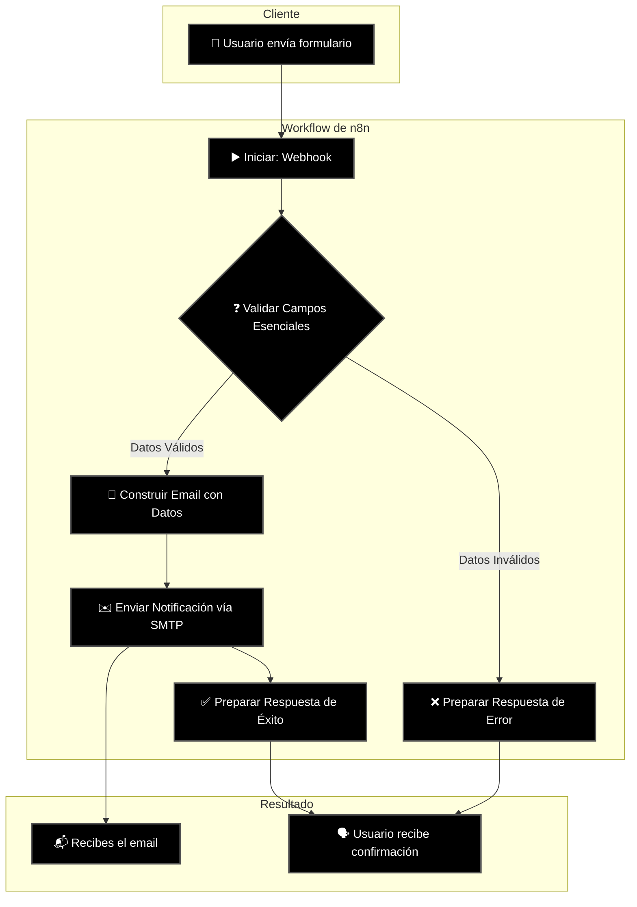

<div align="center">
  <br/>
  <h1>N8N Workflow: Formulario de Contacto Automatizado</h1>
  <p>
    Una solución backend sin código, potente y sencilla para tu formulario de contacto, impulsada por n8n y el envío de email por SMTP.
  </p>
  <p>
    <a href="https://github.com/renebell0/n8n-contact-form/blob/main/LICENSE"></a>
    <a href="https://github.com/renebell0/n8n-contact-form/stargazers"></a>
    <a href="https://github.com/renebell0/n8n-contact-form/network/members"></a>
    <a href="https://github.com/renebell0/n8n-contact-form/issues"></a>
  </p>
</div>

---

Este repositorio contiene un workflow de [n8n](https://n8n.io/) que automatiza la recepción y notificación de envíos de formularios de contacto. Captura datos a través de un Webhook, los valida y envía un correo electrónico de notificación utilizando el nodo **Send Email (SMTP)**.

> **¿Por qué usar este workflow?** Olvídate de configurar un backend complejo. Con este workflow, obtienes una solución robusta, segura y gratuita que puedes configurar en minutos con cualquier proveedor de correo que ofrezca acceso SMTP.

## 📜 Tabla de Contenidos

- [✨ Características Principales](#-características-principales)
- [📊 Diagrama del Flujo](#-diagrama-del-flujo)
- [⚙️ Cómo Funciona: Un Vistazo a los Nodos](#️-cómo-funciona-un-vistazo-a-los-nodos)
- [🚀 Empezando](#-empezando)
  - [Prerrequisitos](#prerrequisitos)
  - [Guía de Instalación Rápida](#guía-de-instalación-rápida)
- [📝 Uso y Personalización](#-uso-y-personalización)
  - [Ejemplo de Formulario HTML](#ejemplo-de-formulario-html)
  - [Pruebas con cURL](#pruebas-con-curl)
- [🤝 Contribuciones](#-contribuciones)
- [📄 Licencia](#-licencia)

## ✨ Características Principales

- ✅ **Implementación Rápida**: Importa el JSON y configura tus credenciales SMTP.
- 🎨 **Totalmente Personalizable**: Adapta los campos, la validación y las plantillas de correo a tu gusto.
- 🔐 **Seguro**: Gestiona tus credenciales SMTP de forma segura con el gestor de credenciales de n8n.
- ⚡ **Eficiente**: Respuesta HTTP instantánea para una mejor experiencia de usuario.
-  universal **Universal**: Compatible con cualquier proveedor de correo electrónico que soporte SMTP (Gmail, Outlook, Zoho, etc.).

## 📊 Diagrama del Flujo

Este diagrama ilustra el camino que siguen los datos desde que el usuario los envía hasta que recibes la notificación.


```mermaid
graph TD
    %% Se define un estilo por defecto con fondo negro y texto blanco para mejorar la visibilidad.
    classDef blackNode fill:#000,stroke:#555,stroke-width:2px,color:#fff

    subgraph "Cliente"
        A[👤 Usuario envía formulario]
    end

    subgraph "Workflow de n8n"
        B[▶️ Iniciar: Webhook]
        C{❓ Validar Campos Esenciales}
        D[📧 Construir Email con Datos]
        E[✉️ Enviar Notificación vía SMTP]
        F[✅ Preparar Respuesta de Éxito]
        G[❌ Preparar Respuesta de Error]
    end
    
    subgraph "Resultado"
        H[📬 Recibes el email]
        I[🗣️ Usuario recibe confirmación]
    end

    A --> B;
    B --> C;
    C -- Datos Válidos --> D;
    D --> E;
    E --> F;
    C -- Datos Inválidos --> G;
    F --> I;
    G --> I;
    E --> H;

    %% Se aplica el estilo a todos los nodos del diagrama.
    class A,B,C,D,E,F,G,H,I blackNode
```

## ⚙️ Cómo Funciona: Un Vistazo a los Nodos

1.  **Webhook**: Es el punto de entrada. Espera una solicitud `POST` con los datos del formulario en formato JSON.
2.  **If (Validación)**: Un nodo crucial que comprueba si los campos `name`, `email` y `message` existen y no están vacíos. Si la validación falla, el workflow toma el camino del error.
3.  **Send Email**: Aquí ocurre la magia. Construye y envía el correo electrónico utilizando las credenciales SMTP que hayas configurado. Las expresiones de n8n (`{{$json.body.name}}`) se utilizan para insertar dinámicamente los datos del formulario en el cuerpo y asunto del email.
4.  **Respond to Webhook**: Proporciona una respuesta inmediata al formulario. Envía un JSON con un mensaje de `éxito` o `error`, permitiendo que tu frontend reaccione en consecuencia.

## 🚀 Empezando

### Prerrequisitos

- Una instancia de **[n8n](https://n8n.io/)** (Cloud o Self-Hosted).
- **Credenciales SMTP** de tu proveedor de correo (servidor, puerto, usuario y contraseña/contraseña de aplicación).
- Un formulario HTML listo para ser conectado.

### Guía de Instalación Rápida

1.  **Clona o descarga** este repositorio:
    ```bash
    git clone [https://github.com/renebell0/n8n-contact-form.git](https://github.com/renebell0/n8n-contact-form.git)
    ```
2.  **Importa** el archivo `ContactForm.json` en tu instancia de n8n.
3.  **Configura las credenciales SMTP**:
    * Haz clic en el nodo **Send Email**.
    * En el panel de `Credentials`, selecciona `Create New`.
    * Elige el servicio preconfigurado (ej. Gmail, Outlook) o selecciona `Generic SMTP`.
    * Rellena los campos con tu servidor SMTP, puerto, usuario, y contraseña. **Nota:** Para servicios como Gmail, es posible que necesites generar una "Contraseña de Aplicación".
4.  **Personaliza el email**: En el mismo nodo, define los correos de remitente (`From Email`) y destinatario (`To Email`), y ajusta el `Subject` y `HTML` a tu gusto.
5.  **Activa el workflow**: Copia la `Production URL` del nodo Webhook, pégala en tu formulario y activa el workflow con el interruptor superior. ¡Listo!

## 📝 Uso y Personalización

### Ejemplo de Formulario HTML

Usa este código como base para tu formulario. Reemplaza `TU_WEBHOOK_URL_DE_N8N_AQUÍ` con tu URL de producción.

<details>
<summary>Haz clic para ver el código del formulario HTML + JS</summary>

```html
<form id="contactForm">
    <div class="form-group">
        <label for="name">Nombre:</label>
        <input type="text" id="name" name="name" required>
    </div>
    <div class="form-group">
        <label for="email">Email:</label>
        <input type="email" id="email" name="email" required>
    </div>
    <div class="form-group">
        <label for="message">Mensaje:</label>
        <textarea id="message" name="message" rows="4" required></textarea>
    </div>
    <button type="submit" id="submitBtn">Enviar Mensaje</button>
    <p id="status"></p>
</form>

<script>
    const form = document.getElementById('contactForm');
    const statusEl = document.getElementById('status');
    const submitBtn = document.getElementById('submitBtn');

    form.addEventListener('submit', async (e) => {
        e.preventDefault();
        submitBtn.disabled = true;
        statusEl.textContent = 'Enviando...';

        const formData = new FormData(form);
        const data = Object.fromEntries(formData.entries());

        try {
            const response = await fetch('TU_WEBHOOK_URL_DE_N8N_AQUÍ', {
                method: 'POST',
                headers: { 'Content-Type': 'application/json' },
                body: JSON.stringify(data),
            });

            const result = await response.json();

            if (response.ok) {
                statusEl.textContent = '¡Mensaje enviado con éxito!';
                statusEl.style.color = 'green';
                form.reset();
            } else {
                throw new Error(result.message || 'Error en el servidor.');
            }

        } catch (error) {
            statusEl.textContent = `Error: ${error.message}`;
            statusEl.style.color = 'red';
        } finally {
            submitBtn.disabled = false;
        }
    });
</script>
```
</details>

### Pruebas con cURL

Para probar rápidamente tu webhook sin un formulario, usa `curl` desde tu terminal:

```bash
curl -X POST -H "Content-Type: application/json" \
-d '{"name":"René", "email":"test@example.com", "message":"Hola Mundo desde cURL!"}' \
TU_URL_DE_PRUEBA_DEL_WEBHOOK
```

## 🤝 Contribuciones

¡Las contribuciones son más que bienvenidas! Si tienes una idea para mejorar el workflow o encuentras un error, por favor, abre un [issue](https://github.com/renebell0/n8n-contact-form/issues) o envía un Pull Request.

## 📄 Licencia

Este proyecto está distribuido bajo la Licencia MIT. Ver el archivo `LICENSE` para más detalles.
